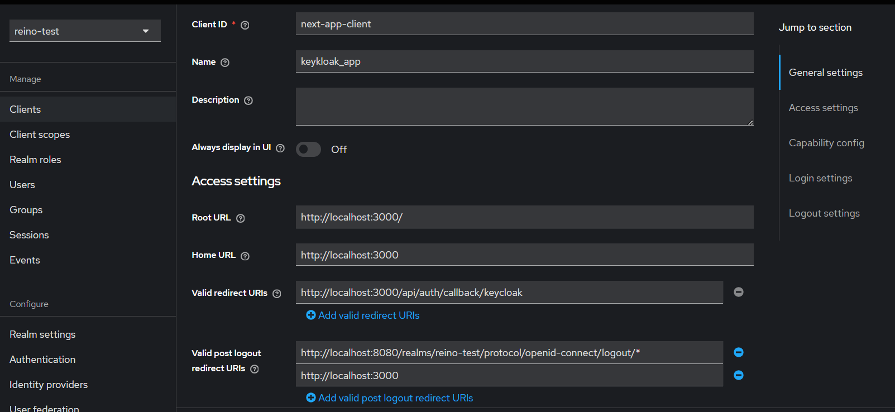
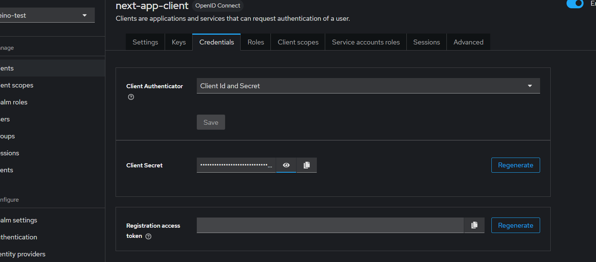
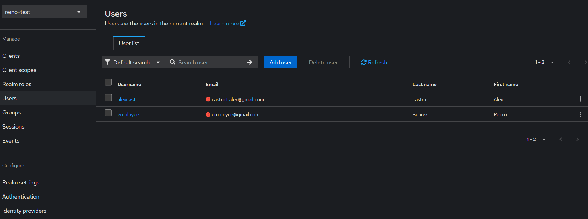
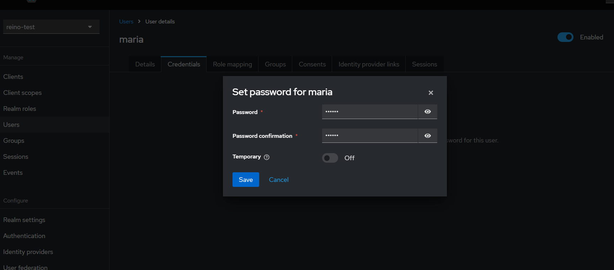
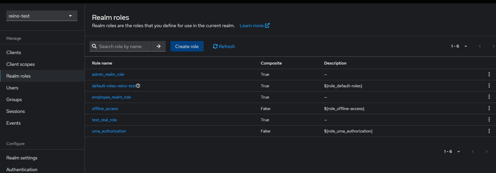
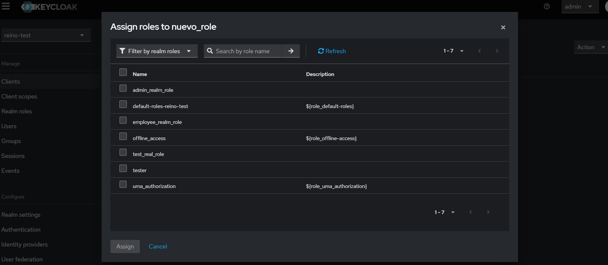
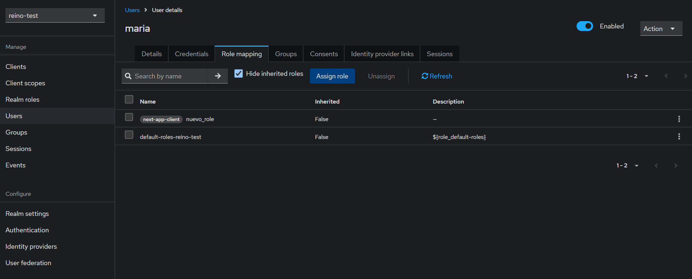

# Project keycloak_app_test

This repository contains the source code for the keycloak app test. Below you will find the steps to clone the repository, install dependencies, configure environment variables, and run the container using Docker.

## Requirements

- Node.js (v20)
- Docker and Docker Compose
- https://www.keycloak.org/docs/latest/server_admin/index.html#assigning-permissions-using-roles-and-groups

## Instructions

### 1. Clone the repository

First, clone this repository to your local machine using `git`:

```bash
git clone https://github.com/Alexcastr/keyclauk_app_test.git
```

### 2. Navigate to the repository
```bash
cd repository-name
```

### 3. Configure environment variables, check the:
.env.example


### 4. Run the container

```bash
docker-compose up -d

```


### 5 keycloak config

- Go to the following URL --> <http://localhost:8080> 
- To log in, use the username and password entered in the docker-compose.yml. Default: (admin | admin)
- Create a new realm for the app  --> **This name is important for use in some endpoints in the .env**
- You must create a client  --> This will be your **KEYCLOAK_CLIENT_ID** variable, and you must change the **realm** name in each URL need it.
  
  

- Also, create the KEYCLOAK_CLIENT_SECRET 

    


- Create at least two users (admin - employee), the user with the admin role will be able to access private routes, but roles have not yet been assigned. These will be created in the following steps.
  




-  Go to Realm roles --> Create roles (The role for private routes should be called **admin_realm_role**)



- Then, within your realm, go to Clients --> Roles, create a role, and then go to actions on the right side and assign the realm role, for example **admin_realm_role**




- Go back to the Users section and assign the administrator role.




### 6. Install dependencies
```bash
npm install

```
